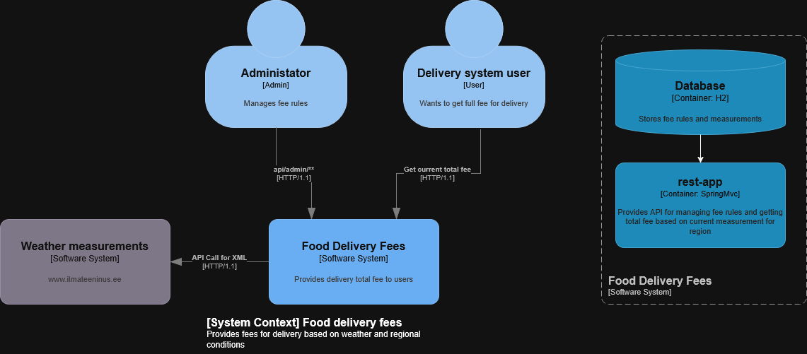

# Fujitsu-backend

Navigation
- [Introduction](#introduction)
- [Fast start](#fast-start)
- [Changelogs](docs/CHANGELOG.md)
- [Project visualization](docs/VISUALIZATION.md)
- [Project workflow](docs/WORKFLOW.md)
- [Authors](#authors)
- [License](#license)

# Introduction

## Note
This is a Practice-driven project and this doesn't stay as MVP or Production-ready.

## System context

## Project description
Provides endpoints to creating, reading, deleting:
fee rules, allowed regions and vehicles. Parses `ilmateenistus.ee`
to get fresh weather measurements using memory and CPU efficient XML parser.

## Task
The objective of the task is to develop a sub-functionality of the food delivery application, which
calculates the delivery fee for food couriers based on regional base fee, vehicle type, and weather
conditions.

# Fast start

Running production profile with Docker

### Note
That runs a separate H2 container without any data,
which is not exposed in the internet.

### Installation
Clone the repo to your local machine.

`git clone https://github.com/No1Evil/CGI-Restaurant.git`

### Configuring environment variables
Create `.env` in root directory and copy contains of `.env.example`

Or use: `cp .env.example .env`

Set variable `SPRING_PROFILES_ACTIVE` to `prod` 

### Running
***Make sure you have docker installed***

`docker compose --profile prod up -d --build`

---

Running development profile with Docker

### Note
That runs an embedded H2 database.

### Installation
Clone the repo to your local machine

`git clone https://github.com/No1Evil/CGI-Restaurant.git`

### Configuring environment variables
Create `.env` in root directory and copy contains of `.env.example`

Or use: `cp .env.example .env`

Set variable `SPRING_PROFILES_ACTIVE` to `dev`

### Running
***Make sure you have docker installed***

`docker compose --profile dev up -d --build`

---

Running dev in IDE

### Note
That runs an embedded H2 database.

### Installation
Clone the repo to your local machine.

`git clone https://github.com/No1Evil/CGI-Restaurant.git`

### Configuring environment variables
Configure environment variable `JWT_TOKEN` and `SPRING_PROFILES_ACTIVE=dev`
in your IDE.

### Running
Module `rest-app` -> `bootRun`

---
## Authors
- Fjodor Tšumakov
## License
[MIT license](LICENSE)